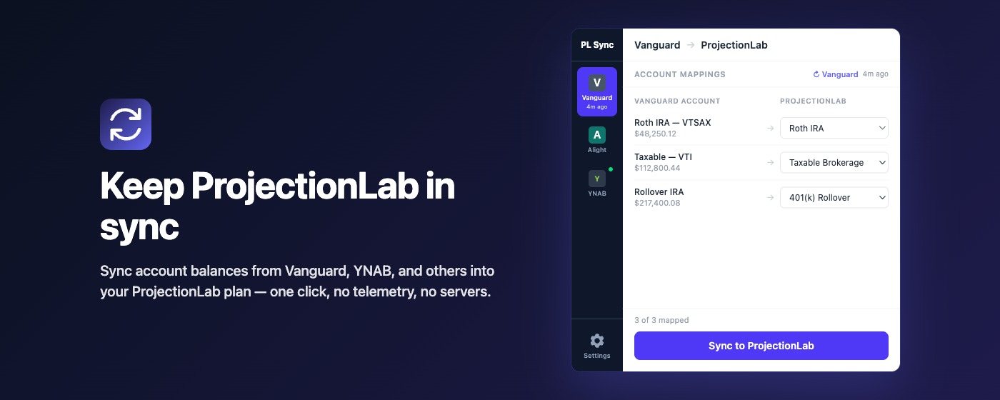

# ProjectionLab Account Sync

A Chrome/Firefox browser extension that syncs account balances from financial institutions into [ProjectionLab](https://projectionlab.com).

  

> [!NOTE]
> This extension is not affiliated with, endorsed by, or maintained by ProjectionLab, Vanguard, Alight, YNAB, or any other financial institution. It is an independent community tool that uses ProjectionLab's plugin API.

## Supported sources

- **Vanguard** — scrapes balances from the portfolio overview page
- **Alight** — scrapes balances from the retirement overview page
- **YNAB** — fetches balances via the YNAB API using a Personal Access Token

## How it works

Sources come in two flavors:

- **Content sources** read balances from a page you have open in your browser. Open the institution's site, then click **↻ [Source]** in the extension popup.
- **API sources** fetch balances directly from the institution's API. Add your credentials in **Settings**, then click **↻ [Source]** in the popup — no site visit needed.

Once you've pulled balances:

1. Open ProjectionLab, then click **↻ ProjectionLab** to load your PL accounts
2. Map each source account to its corresponding ProjectionLab account
3. Click **Sync to ProjectionLab** to push balances

A ProjectionLab API key is required. Add it in the extension's **Settings** panel.

## Intended use

This extension is designed for personal use only — syncing your own accounts for your own financial planning. It is intended to be used infrequently (e.g. monthly when reviewing your plan), not on an automated or scheduled basis. Users are responsible for ensuring their own use.

## Privacy

Account balances are read directly from your browser (or fetched from the institution's API with credentials you provide) and sent only to the ProjectionLab API using your own API key. No data is stored remotely or transmitted anywhere else. API keys and tokens are stored in `localstorage` — local to your browser, never synced or shared.

See [PRIVACY.md](PRIVACY.md) for the full privacy policy.

## Contributing

See [CONTRIBUTING.md](CONTRIBUTING.md) for development setup, testing, and how to add support for a new financial institution.
